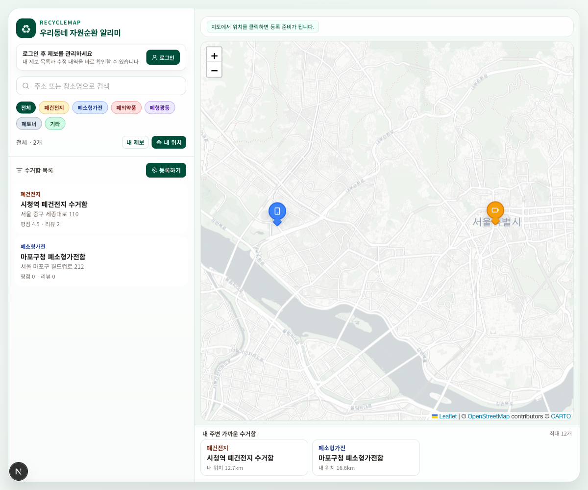
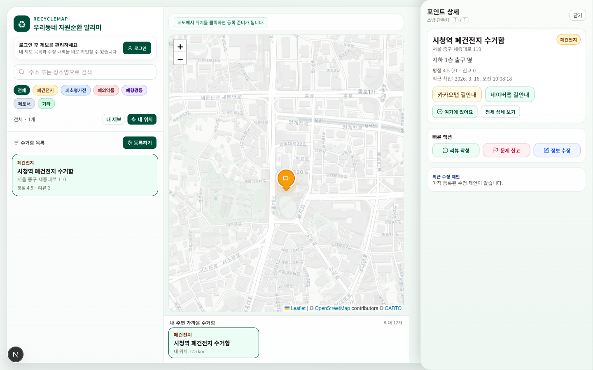
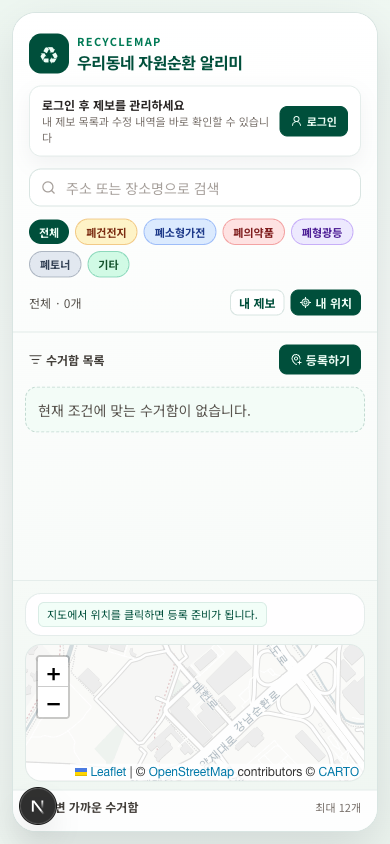

<div align="center">
  <h1>♻ RecycleMap</h1>
  <p><strong>우리동네 자원순환 알리미</strong></p>
  <p>주변 재활용 수거함 위치를 지도에서 확인하고,<br>직접 제보·수정·신고·리뷰로 데이터를 함께 개선하는 지도 서비스</p>
</div>

<p align="center">
  <a href="https://github.com/JakeKang/recycle-map/actions/workflows/release-gate.yml">
    
  </a>
  
  
  
</p>

> **🚧 현재 개발 진행중인 프로젝트입니다.**  
> MVP 기능 구현 및 안정화가 진행 중이며, 지속적인 변경이 발생할 수 있습니다.

---

## 스크린샷

| 홈 (데스크톱) | 수거함 상세 (데스크톱) | 홈 (모바일) |
|:---:|:---:|:---:|
|  |  |  |

---

## 핵심 기능

| 기능 | 설명 |
|------|------|
| **지도 탐색** | Leaflet 기반 수거함 지도, 카테고리별 커스텀 마커, 현재 위치 자동 진입 |
| **수거함 제보** | 지도 클릭으로 위치 지정, Daum 주소 검색, 사진 업로드 |
| **커뮤니티 관리** | 리뷰 작성, 위치 신고, 수정 제안으로 정보 정확성 유지 |
| **내 제보 관리** | 제보 이력 확인 및 딥링크(`/?reports=1`) 직접 진입 |
| **URL 딥링크** | `q` · `category` · `point` · `sheet` · `reports` 상태 동기화 및 뒤로가기 복원 |
| **반응형 UI** | 모바일 지도 우선(햄버거 드로어) / 데스크톱 사이드 패널 |
| **관리자 대시보드** | 신고 처리, 수정 제안 승인, 포인트 상태 관리 |
| **계정 관리** | `/account` 페이지, 소셜 로그인(Google · Kakao · Naver) |

---

## 빠른 시작

```bash
# 저장소 복제
git clone https://github.com/JakeKang/recycle-map.git
cd recycle-map

# 의존성 설치
pnpm install

# 환경 변수 설정 (아래 환경 변수 섹션 참고)
# .env.development 파일을 생성하세요

# 개발 서버 시작
pnpm dev
```

앱: `http://localhost:3000`

---

## 환경 변수

| 변수 | 설명 | 필수 |
|------|------|:---:|
| `NEXTAUTH_URL` | 서비스 URL (production은 `https://` 필수) | ✅ |
| `NEXTAUTH_SECRET` | NextAuth 서명 비밀키 (32자 이상) | ✅ |
| `NEXT_PUBLIC_SUPABASE_URL` | Supabase 프로젝트 URL | ✅ |
| `NEXT_PUBLIC_SUPABASE_ANON_KEY` | Supabase Anon 공개 키 | ✅ |
| `GOOGLE_CLIENT_ID` / `GOOGLE_CLIENT_SECRET` | Google OAuth | 선택 |
| `KAKAO_CLIENT_ID` / `KAKAO_CLIENT_SECRET` | 카카오 OAuth | 선택 |
| `ALLOW_DEV_USER_HEADER` | 개발용 헤더 인증 허용 (dev only: `true`) | 개발 |
| `FORCE_LOCAL_STORE` | DB 없이 메모리 스토어 사용 | 개발 |

> ⚠️ 프로덕션에서는 `ALLOW_DEV_USER_HEADER=false`, `FORCE_LOCAL_STORE=false`를 반드시 확인하세요.  
> 민감 정보는 절대 Git에 커밋하지 않습니다.

---

## 기술 스택

| 영역 | 기술 |
|------|------|
| 프레임워크 | [Next.js 16](https://nextjs.org) (App Router) |
| 언어 | TypeScript 5 |
| 지도 | [Leaflet](https://leafletjs.com) + react-leaflet + markercluster |
| 서버 상태 | [TanStack Query v5](https://tanstack.com/query) |
| 클라이언트 상태 | [Zustand](https://zustand-demo.pmnd.rs) |
| 인증 | [NextAuth.js](https://next-auth.js.org) |
| DB | [Supabase](https://supabase.com) (PostgreSQL) + 메모리 폴백 스토어 |
| 스타일 | [Tailwind CSS](https://tailwindcss.com) |
| 입력 검증 | [Zod](https://zod.dev) |
| 단위 테스트 | [Vitest](https://vitest.dev) v4 (13 files / 33 tests) |
| E2E 테스트 | [Playwright](https://playwright.dev) v1.58 (5 tests) |

---

## 프로젝트 구조

```
src/
├── app/
│   ├── page.tsx                      # 메인 지도 화면
│   ├── account/page.tsx              # 계정 정보
│   ├── admin/page.tsx                # 관리자 대시보드
│   ├── login/                        # 로그인 (테스트 계정 / 소셜)
│   ├── point/[id]/page.tsx           # 수거함 상세 (독립 페이지)
│   └── api/
│       ├── points/                   # 수거함 CRUD · 리뷰 · 신고 · 수정 제안
│       ├── admin/                    # 관리자 결정 API
│       └── upload/                   # 이미지 업로드 · 다운로드
├── components/
│   ├── map/                          # MapContainer, MapView, PointPopupContent
│   ├── panel/                        # SidebarPanelContent, PointDetailSheet, MyReportsSheet
│   ├── point/                        # RegisterPointDialog, PointForm, AddressSearch
│   ├── common/                       # AuthStatus, ActionDialog
│   ├── account/                      # AccountActions
│   └── admin/                        # AdminDashboardClient
├── hooks/
│   ├── usePoints.ts                  # 포인트 목록·상세·뮤테이션
│   ├── useGeolocation.ts             # 위치 요청 커스텀 훅
│   └── useIsMobile.ts                # 반응형 미디어쿼리 훅
├── lib/
│   ├── data-repository.ts            # Supabase 쿼리 계층
│   ├── data-store.ts                 # 메모리 폴백 스토어
│   ├── public-mappers.ts             # PII 제거용 PublicPoint · PublicReview 타입
│   ├── distance.ts                   # haversineMeters 공용 거리 계산
│   ├── query-keys.ts                 # TanStack Query 키 중앙화
│   ├── rate-limit.ts                 # 인메모리 레이트 리미터
│   ├── request-security.ts           # same-origin 체크
│   ├── request-user.ts               # NextAuth 세션 기반 사용자 확인
│   ├── validators.ts                 # Zod 스키마
│   ├── local-file-storage.ts         # 파일 업로드 (magic-byte 검증 · path traversal 방지)
│   └── auth-options.ts               # NextAuth 설정
├── stores/
│   └── mapStore.ts                   # 지도 상태 (Zustand)
└── types/                            # point · review · report · suggestion · admin
```

---

## 보안

| 항목 | 상태 |
|------|------|
| SQL 인젝션 | ✅ Supabase 파라미터 쿼리 전용, raw SQL 없음 |
| XSS | ✅ React JSX 자동 이스케이프, DivIcon에 사용자 문자열 미포함 |
| PII 노출 | ✅ `userId`(소셜 sub claim)를 모든 공개 API 응답에서 제거 |
| 매스 어사인먼트 | ✅ Zod 스키마 allowlist 검증 |
| CSRF | ✅ 모든 변경 요청에 `isSameOriginRequest` 체크 |
| 오픈 리다이렉트 | ✅ `sanitizeCallbackUrl`로 상대 경로만 허용 |
| 레이트 리밋 | ✅ 주요 쓰기 엔드포인트 rate limit 적용 |
| 파일 업로드 | ✅ magic-byte MIME 검증 + path traversal 방지 |
| 보안 헤더 | ✅ `X-Content-Type-Options` · `X-Frame-Options` · `Referrer-Policy` 전역 적용 |
| 의존성 취약점 | ✅ `pnpm audit --prod` 기준 취약점 없음 |

---

## 품질 게이트

```bash
pnpm lint                   # ESLint (error 0, warning 0)
pnpm test                   # Vitest 단위·통합 (13 files / 33 tests)
pnpm test:e2e               # Playwright E2E (5 tests)
pnpm build                  # Next.js 프로덕션 빌드
pnpm security:audit         # 의존성 보안 감사
pnpm predeploy:check        # env · migration 사전 점검
pnpm predeploy:verify       # 통합 릴리즈 게이트 (개발)
pnpm predeploy:verify:full  # 통합 릴리즈 게이트 (프로덕션)
pnpm perf:smoke             # 성능 스모크 (synthetic 3,000 points)
pnpm perf:smoke:prodlike    # 성능 스모크 (프로덕션 유사)
```

CI는 모든 PR / `main` 푸시에서 게이트 파이프라인을 자동 실행합니다.  
워크플로우: `.github/workflows/release-gate.yml`

---

## 릴리즈 노트

### MVP — 2026-03

- 지도 탐색 · 수거함 제보 · 리뷰 · 신고 · 수정 제안 · 내 제보 관리 전 흐름 완성
- 소셜 로그인 연동 (Google · Kakao · Naver)
- 모바일 지도 우선 UX + 햄버거 드로어
- URL 딥링크 상태 동기화 + 브라우저 히스토리 복원
- 보안: PII 응답 제거 · admin API 강화 · 보안 헤더 전역 적용
- 리팩터링: 거리 계산 · 위치 훅 · 모바일 훅 · ActionDialog · QueryKeys 분리

---

## 이슈

- **버그 리포트 / 기능 제안**: [GitHub Issues](https://github.com/JakeKang/recycle-map/issues)

---

## 라이선스

MIT

---

<div align="center">
  <sub>Next.js · Leaflet · Supabase · NextAuth · Tailwind CSS 기반으로 구축되었습니다.</sub>
</div>
