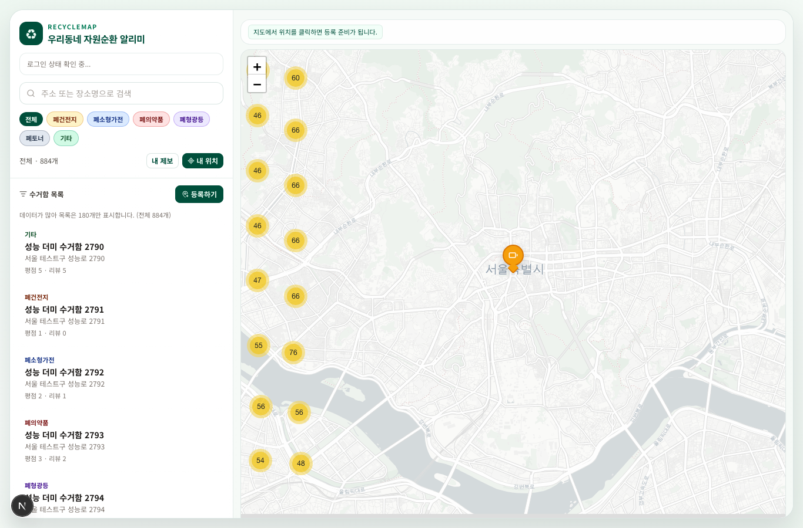

# RecycleMap

우리동네 자원순환 알리미.  
사용자가 주변 재활용 수거함 위치를 확인하고, 직접 제보/수정/신고/리뷰로 데이터를 개선하는 지도 서비스입니다.

## Screenshots




## Current MVP Status

- 메인 흐름: 지도 탐색 -> 위치 선택 제보 -> 상세/리뷰/신고 -> 내 제보 관리
- 인증 흐름: 사이드바 통합 로그인/회원정보/로그아웃 + `/account`
- URL 딥링크: `q`, `category`, `point`, `sheet`, `reports`
- 지도 최적화: 커스텀 마커 유지 + 선택 오버레이/아이콘 캐시 + 단일 visible 조회

## Key Features

- Leaflet 지도 + 카테고리 커스텀 마커
- 수거함 등록/상세/수정 제안/신고/리뷰
- 내 제보 관리 시트 및 계정 페이지
- 모바일 바텀시트 + 데스크톱 사이드 패널
- API 입력 검증(zod), origin 체크, rate limit

## Performance and Security

- 성능 스모크 실행: `pnpm perf:smoke`
- 프로덕션 유사 성능 스모크: `pnpm perf:smoke:prodlike`
- 보안 감사: `pnpm security:audit`
- 릴리즈 통합 게이트: `pnpm predeploy:verify` / `pnpm predeploy:verify:full`

## Tech Stack

- Next.js (App Router), TypeScript
- React Query, Zustand
- Leaflet + react-leaflet + markercluster
- NextAuth
- Supabase (with local fallback store)
- Vitest, Playwright

## Getting Started

```bash
pnpm install
pnpm dev
```

App: `http://localhost:3000`

## Scripts

- `pnpm lint` - eslint
- `pnpm test` - unit/integration tests
- `pnpm test:e2e` - Playwright e2e
- `pnpm build` - production build
- `pnpm predeploy:check` - env/migration predeploy checks
- `pnpm perf:smoke` - synthetic map/load performance smoke test
- `pnpm perf:smoke:prodlike` - production-like performance smoke (requires DB-ready env)
- `pnpm security:audit` - production dependency audit

## CI Gate

- GitHub Actions release gate: `.github/workflows/release-gate.yml`
- Runs: predeploy(dev) check, lint, tests, build, security audit, e2e

## Environment Notes

- `.env.development`, `.env.production` are required for full verification.
- Production must keep dev bypass flags disabled (`ALLOW_DEV_USER_HEADER=false`, `FORCE_LOCAL_STORE=false`).

## License

MIT
